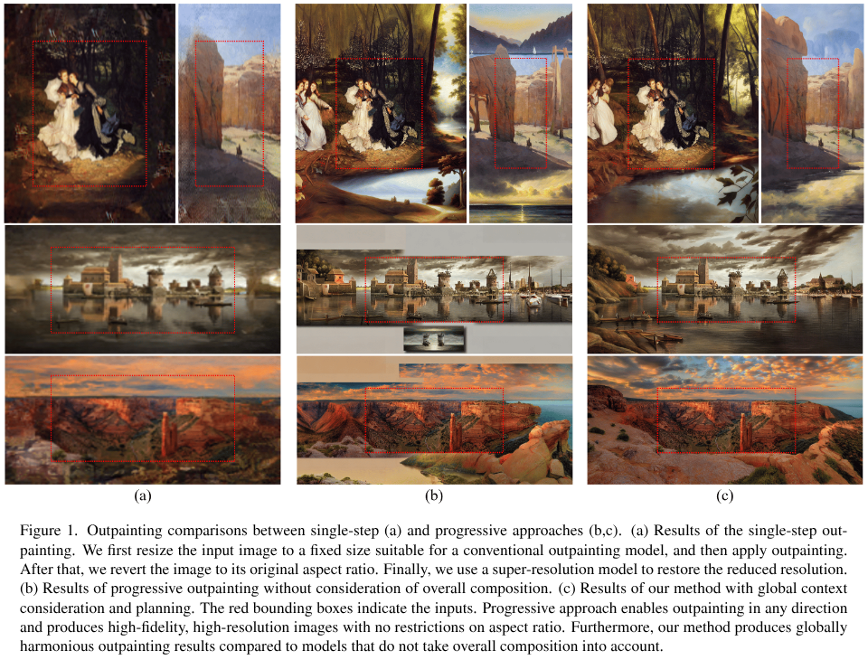
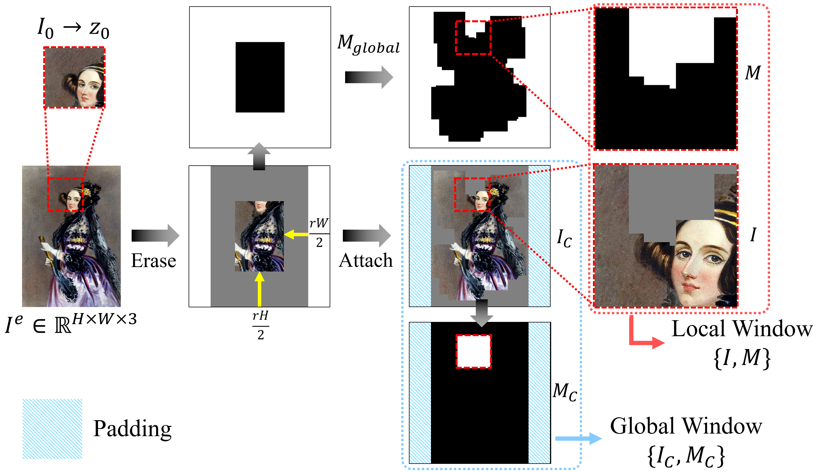
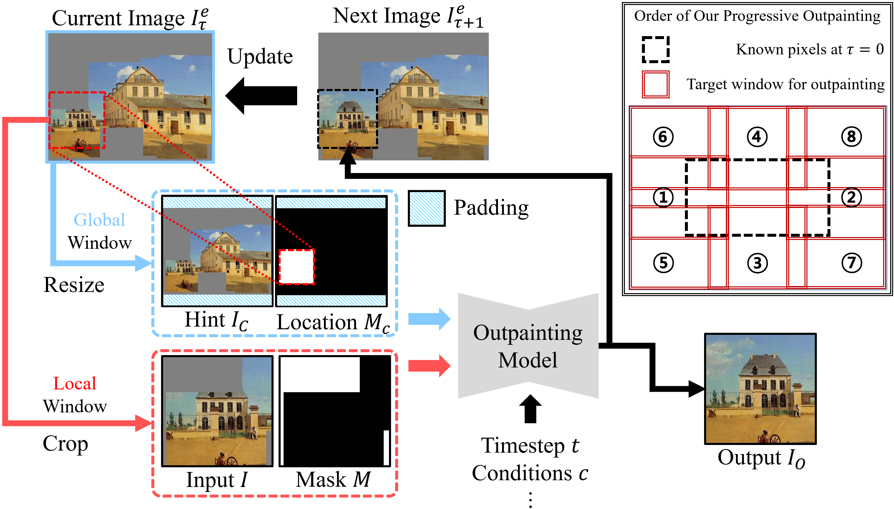

# Progressive Artwork Outpainting via Latent Diffusion Models

[](https://arxiv.org/abs/XXXX.XXXXX)
[](https://arxiv.org/abs/XXXX.XXXXX)
- The hyperlink will be updated!

The official repository of **Progressive Artwork Outpainting via Latent Diffusion Models** (ICCV 2025).

[Dae-Young Song](https://eadcat.github.io/), Jung-Jae Yu, [Donghyeon Cho](https://scholar.google.com/citations?user=zj-NER4AAAAJ&hl=en)

<p align="center">
  
</p>

## 📋 Abstract
Latent diffusion models have demonstrated superior performance over traditional methods in generating highly detailed and aesthetically pleasing images, which makes them widely used for various image generation and editing tasks, including outpainting. However, most LDM-based outpainting methods impose constraints on resolution and aspect ratio, often leading to the loss of local details and blurring. One way to address these issues is progressive outpainting, where the image is extended outward incrementally. However, naive progressive outpainting suffers from two key challenges: (1) difficulty in effectively capturing global context, making it hard to maintain the original context, and (2) a tendency to generate unnatural patterns. These challenges are particularly pronounced in art, where artists pre-design the composition before painting. As a result, existing methods often introduce visual inconsistencies that distract the viewer and diminish the intended artistic emphasis. To address these limitations, we propose two types of composition planning modules that enhance progressive outpainting by leveraging global structural guidance. These modules guide a pre-trained stable diffusion model to consider the overall composition, enabling realistic and contextually appropriate artwork completion without labor-intensive user prompts. Through experiments on diverse artwork images, we show the effectiveness of our proposed method both quantitatively and qualitatively.

## 🎯 Overview
Inspired by [stablediffusion-infinity](https://github.com/lkwq007/stablediffusion-infinity), we started this project to achieve outpainting that is consistent with the original content and style. <b><i>Due to institutional policies</i></b>, most of the project's source code cannot be released, but <b>we are making the data augmentation algorithms described in the paper publicly available.</b> Since the loss function is the same as the widely known stable diffusion training method, we believe that architectures like ControlNet will serve as a good baseline for the task proposed in the paper.

## 📚 Useful References for Reproduction
We recommend the following links to reproduce our task and project!
### Architectures
- SD Inpainting: https://huggingface.co/stable-diffusion-v1-5/stable-diffusion-inpainting
- ControlNet: https://github.com/lllyasviel/ControlNet
  
### Datasets
- LAION High-resolution: https://huggingface.co/datasets/laion/laion-high-resolution
- LAION Aesthetics: https://github.com/LAION-AI/laion-datasets/blob/main/laion-aesthetic.md
- WikiArt: https://github.com/cs-chan/ArtGAN/blob/master/WikiArt%20Dataset/README.md
- IconArt: https://wsoda.telecom-paristech.fr
- HumanArt: https://github.com/IDEA-Research/HumanArt
- BLIP: https://github.com/salesforce/BLIP
- BLIP2: https://github.com/salesforce/LAVIS
- Regular Expressions: https://github.com/GongyeLiu/StyleCrafter/issues/7

### 

## 🚀 Visualization Demo

### Prerequisites
```bash
conda create -n proout python=3.10 -y
conda activate proout
conda install numpy pillow einops
pip install opencv-python
```
 PyTorch: https://pytorch.org/get-started/locally/


### Usage

```python
python vis.py
```

## 🖼️ Illustration
<p align="center">
  
  <p align="center" style="margin-top:-20px;"><b>Training Dataset Augmentation Workflow</b></p>
</p>

---

<p align="center">
  
  <p align="center" style="margin-top:-20px;"><b>Progressive Outpainting Task</b></p>
</p>

## 📬 Contact

For any questions, discussions, or commercial use inquiries, please contact the email below.

- eadyoung@etri.re.kr


## 📝 Citation

If you find this work useful for your research, please cite our paper:

```bibtex
@inproceedings{song2025proout,
  title={Progressive Artwork Outpainting via Latent Diffusion Models},
  author={Song, Dae-Young and Yu, Jung-Jae and Cho, Donghyeon},
  booktitle={Proceedings of the IEEE/CVF International Conference on 
  Computer Vision (ICCV)},
  year={2025}
}
```